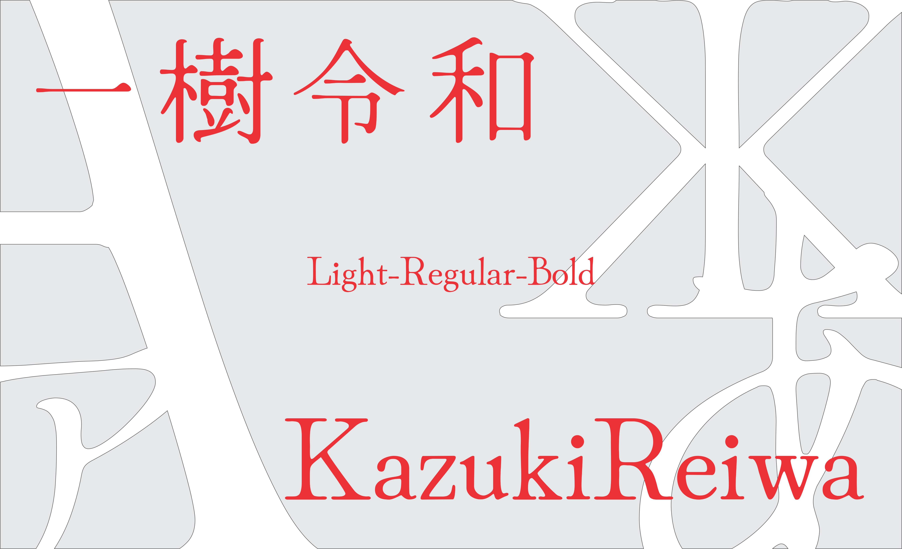

Kazuki Kimura 
============

:arrow_down::arrow_down::arrow_down::arrow_down::arrow_down:

<strong>**Example how does it looks like for each language**</strong>

  

  

  

  

  

:arrow_up::arrow_up::arrow_up::arrow_up::arrow_up:

# KazukiReiwa Project
This project is intended to provide a free and open font family for all current languages and writing systems that use Latin, Cyrillic, Japanese, Greek and Braille scripts. 

It supports almost the complete range of Unicode characters for these scripts, including a comprehensive range of diacritics and a large set of symbols useful for linguistics and literacy work. Smart font routines automatically adjust the position of diacritics to support and optimize arbitrary base+diacritic combinations. 

To download the fonts visit the [Kazuki Kimura's downloads page](https://github.com/KazukiKimuraJP/KazukiReiwa), the [Email](kazuki.kimura.jp@gmail.com) or from my [official site](https://www.kazukikimura.com).

## Basic Information
Basic Latin letters (numbers and punctuation) was added in 2020 (September) 
Russian letters in 2020 (November) 
Greek letters in 2020 (December) 
Japanese in 2021 (November) 
Refactored hitting and kernings in 2021 (December) 
Added Braille in 2021 (January) 
Fixed kernings and size for small ppm in 2021 (January)

- KazukiReiwa Light, Medium, Bold were released in 2022 (20 January)

## Designer
Kazuki Kimura

## License
SIL Open Font License ([OFL.txt](OFL.txt))
SIL Open Font License ([OFL-FAQ.txt](OFL-FAQ.txt))
